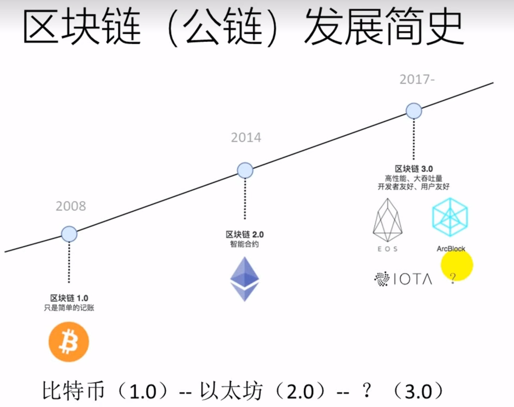

## 区块链（公链）发展简史

区块链 1.0 是比特币：比特币只是简单的记账

区块链 2.0 是以太坊：智能合约

## 以太坊特点

- 以太坊是“世界计算机”，着代表它是一个开源的，全球分布的计算基础设施。
- 执行称为“智能合约”的程序。

## 以太坊的组成部分

- P2P 网络
- 交易
- 以太坊虚拟机（EVM）
- 数据库（BlockChain）
- 客户端

## 以太坊的重要概念

- 账户
  - 普通账户：存储和代码都为空
  - 合约账户：包含存储和代码
- 地址
- 交易
- gas

## 以太坊的货币

 

以太币单位

