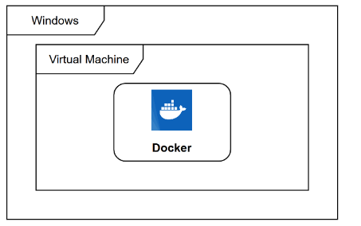

# Docker 介绍

Docker（/'da:ker/） 是一个开源的应用容器引擎，基于 Go 语言并遵从 Apache 2.0 协议开源。

Docker 可以让开发者打包他们的应用以及依赖包到一个**轻量级**，**可移植**的容器中，然后发布到任何流行的 Linux 机器上，也可以实现虚拟化。

容器是完全使用沙盒机制，相互之间不会有任何接口，更重要的是容器性能开销极低。

Docker 从 17.03 版本之后分为 CE（Community Edition：社区版）和 EE（Enterprise Edition：企业版），使用社区版就行了。

## 应用场景

- Web 应用的**自动化打包和发布**。
- 自动化测试和**持续集成，发布**。
- 在服务型环境中部署和调整数据库或其他的后台应用。
- 从头编译或者扩展现有的 OpenShift 或 Cloud Foundry 平台来搭建自己的 PaaS 环境。

## 优点

- 快速，一致的交付您的应用程序
- 响应式部署和扩展
- 在同一硬件上运行更多工作负载

## windows 中

**Docker 实际上是已经运行的 Linux 下创造了一个隔离的文件环境**，因此它执行的效率几乎等同于所部署的 Linux 主机。因此，Docker 必须部署在 Linux 内核的系统上。如果其他系统想部署 Docker 就必须安装一个虚拟 Linux 环境。

