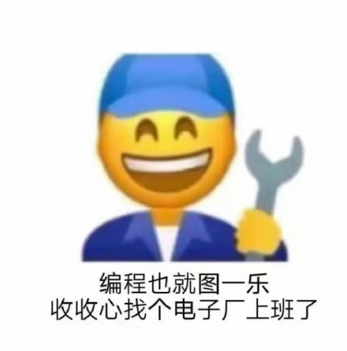

# 记录下第一次被辞退

本人 00 后打工仔一个，今天下午消防演练跑下楼买了包辣条🥓，上来就被主管拉去开会，告知我使用期没有过。其实早有感觉了，从和主管玩的好的同事看我的眼神就能体会到，包括说本来是 6 个月转正的，后面 3 个月就钉钉通知我转正了（我真的以为提前转正加工资乐呵呵了哈哈哈）。主管给到我的理由是我上次新人培训时没有全程听而是中途跑了回来，这件事领导非常看重，认为我没有了解公司业务，以及对业务没有很重视，认为我态度有问题（其实我知道这件事是一个破局点吧，主要还是我平时不怎么加班）。还有一点就是我平时没有及时反馈开发进度，没有及时点击收到，并回复，其实事我都做了（对领导爱答不理，想想我也是挺勇的）。

emm。认了。但我也觉得人之常情吧，没有什么事是绝对的谁对谁错。我们这个公司是一个医疗公司（当时我也是犹豫了很久才入职这个公司，考虑到不是互联网公司），然后培训的内容大多医学相关，公司有很多医学大牛（博士硕士啥的，说的占比 30%），感觉这个培训也不是针对说我们这些程序仔听的。我上午去听了大概两个小时，觉得确实晦涩难懂啊，铁子们，嘎嘎多的医学理论（我也是边玩手机边听），我同事更好，直接打起了麻将。然后后面我看我们开发部的大佬，还有后端都走了，我也溜了。结果，出了大厦，我回了公司，他两聪明，直接去玩去了。搞得上午就我一个人跑了路。中午直接在电梯被领导哼斗了一番。下午，我看他们也都去签个到就走，我也跟着他们一路走，然后一起签到，签到完就回工位了。到最后，搞得我成了那个态度不佳的了，还蛮不解的。

在这家公司吧，刚刚入职的时候，纯纯的切图仔，照着别人的代码，切了一个公众号。之后又是切官网，主要是说公司 8 周年吧，官网要更新，然后领导就对着那些细节死扣，改了几个字就大有所为的样子，哈哈哈。我本身对做切图还是蛮反感的，挺没技术含量的，但我也不好表现出来。之后就是挺长时间的没事儿做，一转眼要到周五了都。不给我活我周报咋写😭。我感觉找主管啊，没啥活做吗，没啥活做吗，生怕摸鱼太明显。然后主管让我做官网的优化，我当时也挺想笑的。觉得他认真的吗哈哈哈，太看的起我了吧。然后我就弄那啥官网，官网还是外包做的，很多地方都是图快，嘎嘎堆功能。然后我就拿 lighthouse 看这官网，确实分很低。然后改了改图片格式（很多图片都没处理，一两 mb 的都有），然后改改图片大小。然后发现他没做懒加载，所有 js 都打在一个 app.js 里。又搞搞 cdn，按需加载组件啥的。确实网站快了一些。主管当时还给我点赞👍，我人都傻了（我感觉这真的没有啥，都是很基础的那种，换我之前 leader 一定是甩给我一句 “就这？”）。所以我当时就觉得这里没有大佬，特别强的那种，就还蛮失望了一段时间。

然后，后面主管说让我重构官网，因为之前官网用的 spa 嘛，所以 seo 基本没有。然后让我拿 nuxt3 对这原来的削一个出来。我还在想要不要做响应式（他之前的官网是两套，电脑端和移动端），有没有设计师来着，结果emm。后面看了一周 nuxt3 和 vue3 文档，就开始削，还是写的 vue3 tsx 写法，有些东西真的搜不到哈哈哈，当时直接麻了。后面削了两周左右把 pc 的官网削了出来，主管又是给我点赞😂，后面也没有发布到线上，具体原因我也不知道，也没问。

再后来，就是给我分配了一个报告管理的系统，对内的。当时看了代码我真的想逃，基本上所有界面都是 table，用的还是 react16.5，一开始我以为 hook 都不能用，真的会谢（package.json 里 是 ^react 16.5 所以还是有 16.8 的 hook 的），而且也没有用 ts。分支管理也是很离谱的，就一个 master，一个 test，一个名字分支，相当于一个项目就是一个人开发。还想着啥 code review，简直可笑啊。所以很多功能都是图快堆的，也不算优雅把。我一般都直接在 test 开发，开发完就合 master，自己批准自己的合并哈哈哈，走走流程。

不过这开发流程真的很不规范，需求都来自内部的领导（学医的），他给我们说需求，emm，没有产品，没有 ui。很多时候他都只是口头描述一下要啥效果，我又当 ui，又敲代码的，不过好在他们对界面效果不是很 care。还有一点就是你做出来东西了，他觉得不合适他又要改，emm。我真的好像说，你一开始能不能想好，宝。快两周时间，都是晚上 7，8 点，瞅了眼系统，说这这要改，那那要改（搞得我后面一度要屏蔽消息了）。

当然我这些都没有表现出来哈哈哈，吐槽归吐槽。但是说实话，我还是太明目张胆了，下班到点先打卡，第二看窗外是否下雨，第三，冲，回家。我一度以为领导不 care 这些，也没找我谈过话，挺开明的哈哈哈😂。

还有就是我不爱说客套话把，不会做表面功夫（因为我上一份实习工作把，这个叫哥，那个叫姐，这次我想硬气一回）。可同事的客套话也真的和我一比，直接更加凸显我的恶劣了。这个叫什么大，那个叫什么总，还有什么博，什么主席，各种敬称层出不穷的，属实也是长眼了。然后钉钉消息总是带几个小表情，显得非常和蔼可亲。哎，比不了比不了。以后也不能太过分，太出众，直接被当出头鸟打了，giao。

我怀疑我被背刺了，上次和后端聊了几句，他培训出去玩了嘛，我就说，我懂，周五嘛，有事下周说。他家伙好的，中午和领导讨论需求打开聊天记录，giao，服了。

给我印象深刻的还有之前我旁边的那博士（官网上有他的信息，所以我才知道），人缘很好，然后看起来就很强，天天怼着英文论文看，也拿到了人才住房，确实很强。

话说回来，公司还有一点挺好的，老板爱发红包，差不多多的可以抢到十来块，还是蛮爽的。还有就是事比较少，天天没啥活（当然可能仅限我，我看他们天天加班），然后可以嘎嘎啃书。

总之这次也是长教训了。下次试用期我直接开卷，就和之前培训老师说的一样，你就最后走，十有八九转正。还有别和同事说太多不该说的话，搞不好被背刺。

最后也不想在深圳待了，这城市有些人能发现它的美，而我发现不了😭（配上鸟图，over）。

