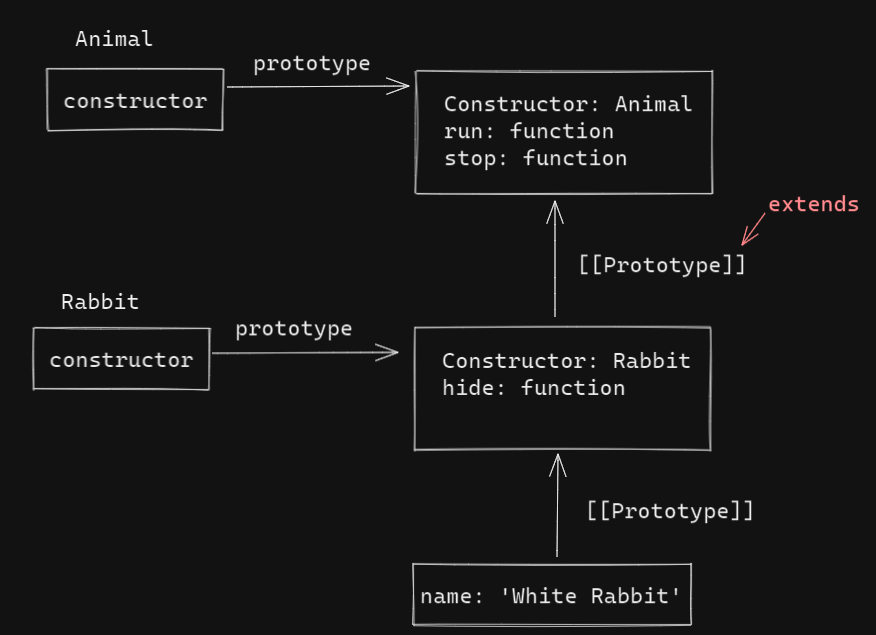

# class

## 基本用法

```js
class MyClass {
  constructor() {}
  method1() {}
  method2() {}
  method3() {}
}
```

使用 new 会自动调用 constructor() 方法，因为我们可以在 constructor() 中初始化对象。

```js
class User() {
  constructor(name) {
    this.name = name;
  }
  sayHi() {
    console.log(this.name);
  }
}

// 用法
let user = new User('john');
user.sayHi();
```


## what

在 JavaScript 中，类是一种函数。

```js
class User {
  constructor(name) {
    this.name = name;
  }
  sayHi() {
    console.log('hi~');
  }
}

console.log(typeof User); // 'function'
```

class User { ... } 实际上做了这些事：

1. 创建一个名为 User 的函数，该函数成为类声明的结果。该函数的代码来自于 constructor 方法（如果没编写，就被假定为空）。
2. 存储类中的方法，例如 User.prototype 中的 sayHi。

当 new User 对象被创建后，当我们调用其方法时，它会从原型中获取对应的方法，正如在函数原型中那样。因此，对象 new User 可以访问类中的方法。


```js
class User {
  constructor(name) {
    this.name = name;
  }
  sayHi() {
    console.log(this.name);
  }
}

console.log(typeof User); // 'function'
console.log(User === User.prototype.constructor); // true
console.log(Object.getOwnPropertyNames(User.prototype)); // constructor, sayHi
```


## 不仅仅是语法糖

有人说 class 是构造函数的一个语法糖（旨在使内容更容易阅读，但不引入任何新内容的语法）。但事实是 class 不仅仅是语法糖。

1. 通过 class 创建的函数具有特殊的内部属性标记 [[IsClassConstructor]] : true。因此，它和手动创建并不完全相同。

   编程语言会在与多地方检查该属性。例如，与普通函数不同，必须使用 new 来调用它。

   ```js
   class User {
     constructor() {}
   }
   User(); // Error: Class constructor User cannot be invoked whihout 'new'
   ```

2. 类方法不可枚举。类定义将 "prototype" 中的所有方法的 enumerable 标志设置为 false。这样我们对一个对象调用 for in ，则不会出现 class 方法。

3. 类总是使用 use strict。在类构造中的所有代码都将自动进入严格模式。


## 类表达式

像函数一样，类可以在另外一个表达式中被定义，被传递，被返回，被赋值等。

```js
let User = class {
  sayHi() {
    console.log('hi~');
  }
}
```

类似命名函数表达式，类表达式也可以有一个名字。

类表达式的名字仅在内部可见。

```js
let User = class MyClass {
  sayHi() {
    console.log(MyClass);
  }
};

new User().sayHi();
console.log(MyClass); // error，外部不可见
```

我们甚至可以按需创建类。 

```js
function makeClass(phrase) {
  return class {
    sayHi() console.log('hi~');
  }
}
let User = makeClass('hello');
new User().sayHi();
```


## Getters/Setters

```js
class User {
  constructor(name) {
    this.name = name;
  }
  
  get name() {
    return this.name;
  }
  
  set name(value) {
    if(value.length < 4) {
      console.log('name is too short.');
      return;
    }
    this.name = value;
  }
}

let user = new User('john');
console.log(user.name); // 'john'
user = new User(''); // name is to short.
```


## 计算属性名称

```js
class User {
  ['say' + 'Hi']() {
    console.log('hello');
  }
}

new User().sayHi();
```


## 字段

```js
class User {
  name: 'john';
  
  sayHi() {
    console.log(`hello, ${this.name}`);
  }
}

new User().sayHi(); // hello, john
```

类字段中重要的不用在于，它们会在每个独立的对象中被设好，而不是设在 User.prototype 中。

```js
class User {
  name = 'john';
}

let user = new User();
console.log(user.name); // john
console.log(User.prototype.name); // undefined
```


## this 丢失

```js
class Button {
  constructor(value) {
    this.value = value;
  }
  click() {
    console.log(this.value);
  }
}

let button = new Button('hello');
setTimeout(button.click, 1000); // undefined
```

**解决办法：**

1. 箭头函数

   ```js
   class Button {
     constructor(value) {
       this.value = value;
     }
     click = () => {
       console.log(this.value);
     }
   }
   
   let button = new Button('hello');
   setTimeout(button.click, 1000); // hello
   ```

2. bind

   ```js
   class Button {
     constructor(value) {
       this.value = value;
       this.click = this.click.bind(this);
     }
     click() {
       console.log(this.value);
     }
   }
   
   let button = new Button('hello');
   setTimeout(button.click, 1000); // hello
   ```

   


## extends

```js
class Animal {
  constructor(name) {
    this.speed = 0;
    this.name = name;
  }
  run(speed) {
    this.speed = speed;
    console.log(`${this.name} runs with speed ${this.speed}.`);
  }
  stop() {
    this.speed = 0;
    console.log(`${this.name} stands still.`);
  }
}

let animal = new Animal('My Animal');

class Rabbit extends Animal {
  hide() {
    console.log(`${this.name} hides!`);
  }
}

let rabbit = new Rabbit('White Rabbit');

rabbit.run(5); // White Rabbit runs with speed 5
rabbit.hide(); // White Rabbit hides!
```

Class Rabbit 的对象可以访问例如 rabbit.hide() 等 Rabbit 的方法，还可以访问例如 rabbit.run() 等 Animal 的方法。

在内部，关键字 extends 使用了很好的旧的原型机制进行工作。它将 Rabbit.prototype.[[Prototype]] 设置为 Animal.prototype。所以，如果在 Rabbit.prototype 中找不到一个方法，JavaScript 就会从 Animal.prototype 中获取该方法。




extends 后允许任意表达式

```js
function f(phrase) {
  return class {
    sayHi() {
      console.log(phrase);
    }
  }
}

class User extends f('hello') {}

new User().sayHi(); // Hello
```


## super

- 执行 super.method(...) 来调用一个父类方法。
- 执行 super(...) 来调用一个父类 constructor（只能在 constructor 中）。

```js
class Rabbit extends Animal {
  stop() {
    super.stop();
    console.log('stop');
  }
}
```

箭头函数没有自己的 super

```js
class Rabbit extends Animal {
  stop() {
    setTimeout(() => super.stop(), 1000); // 1 秒后调用父类的 stop
  }
}
```

```js
class Rabbit extends Animal {
  stop() {
    setTimeout(function() { super.stop() }, 1000); // 报错，意料之外的 super
  }
}
```


## 重写 constructor

根据规范，如果一个类扩展了另一个类并且没有 constructor，那么将会生成下面的空 constructor。

```js
class Rabbit extends Animal {
  constructor(...args) {
    super(...args);
  }
}
```


**规定：在派生类的 constructor 中必须调用 super(...)，并且一定要在使用 this 之前调用。**

```js
class Rabbit extends Animal {
  constructor(name) {
    this.name = name;
  }
}

let rabbit = new Rabbit(); // Error: this is not defined.
```

在 JavaScript 中，继承类（派生构造器，derived constructor）的构造函数与其他函数之前是由区别的。派生构造器具有特殊的内部属性 [[ConstructorKind]]: "derived"。这是一个特殊的内部标签。

该标签会影响它的 new 行为：

- 当通过 new 执行一个常规函数时，它将创建一个空对象，并将这个空对象赋值给 this。
- 但是当继承的 constructor 执行时，它不会执行该操作。它期望父类的 constructor 来完成这项工作。

因此，派生的 constructor 必须调用 super 才能执行其父类（base）的 constructor，否则 this 指向的那个对象将不会被创建，并且得到一个报错。


## 静态属性和静态方法

```js
class User {
  static staticProp = 'prop';
  static staticMethod() {
    console.log(this === User);
  }
}

User.staticMethod(); // true
```

等同于

```js
class User {}

User.staticMethod = function() {
  console.log(this === User);
}

User.staticMethod(); // true
```

静态属性和静态方法是可以被继承的。

