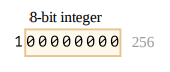
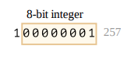
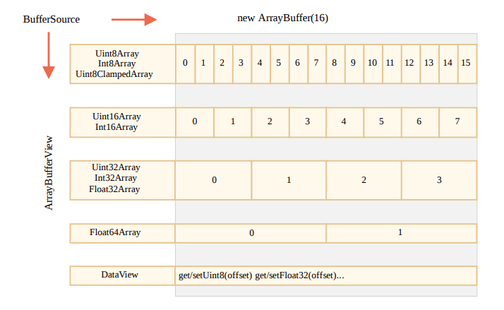

## ArrayBuffer

在  web 开发中，当我们处理文件时（创建，上传，下载），经常会遇到二进制数据。另一个典型的应用场景是图像处理。

这些都可以通过 JavaScript 进行处理，而且二进制操作性能更高。

不过，在 JavaScript 中有很多二进制数据格式。如 ArrayBuffer，Uint8Array，DataView，Blob，File 及其他。

与其他语言相比，JavaScript 中的二进制数据是以非标准方式实现的。

基本的二进制对象是 ArrayBuffer -- 对固定长度的连续内存空间的引用。

```js
let buffer = new ArrayBuffer(16); // 创建长度为 16 的 buffer
console.log(buffer.byteLength); // 16
```

它会分配一个 16 字节的连续内存空间，并用 0 填充。

>  ⚠️ArrayBuffer 不是某种东西的数组
>
> ArrayBuffer 和 Array 没有任何共同之处：
>
> - 它的长度是固定的，无法增减它的长度。
> - 它正好占用了内存中的那么多空间。
> - 要访问单个字节，需要另一个“视图”对象，而不是 buffer[index]。

ArrayBuffer 是一个内存区域。里面存储了什么，无法判断。只是一个原始的字节序列。如果要操作 ArrayBuffer，需要使用“视图”对象。

视图对象本身不存储任何东西，它只是“一副眼镜”，透过它来解释存储在 ArrayBuffer 中的字节。

例如：

- Uint8Array -- 将 ArrayBuffer 中的每个字节视为 0 到 255 之间的单个数字（每个字节是 8 位）。这称为 “8 位无符号整数”
- Uint16Array -- 将每 2 个字节视为一个 0 到 65535 之间的整数。这称为 “16 位无符号整数”。
- Uint32Array -- 将每 4 个字节视为一个 0 到 4294967295 之间的整数。这称为 “32 位无符号整数”。
- Float64Array -- 将每 8 个字节视为一个  5.0x10 -324 到 1.8x10 308 之间 的浮点数。

因此，一个 16 字节 ArrayBuffer 中的二进制数据可以解释为 16 个 “小数字”，或 8 个更大的数字（每个数字两个字节），或 4 个更大的数字（每个数字 4 个字节），或 2 个高精度的浮点数。


ArrayBuffer 是核心对象，是所有的基础，是原始的二进制数据。

但是，如果我们要写入值或者遍历它，基本上几乎所有操作 -- 我们必须使用视图（view）。

```js
let buffer = new ArrayBuffer(16);
let view = new Uint32Array(buffer);

console.log(Uint32Array.BYTES_PER_ELEMENT); // 4，每个元素的字节数
console.log(view.length); // 4，视图长度
console.log(view.byteLength); // 16，视图字节长度

view[0] = 123456;

for(let num of view) {
  console.log(num); // 123456 0 0 0 
}
```


## TypedArray

所有的这些视图（Uint8Array，Uint32Array 等）的通用术语都是 TypedArray。它们都享有同一个组的方法和属性。

> ⚠️没有名为 TypedArray 的构造器，它只是表示 Array Buffer 上的视图之一的通用总称术语。

当看到 new TypedArray 之类的内容时，它表示 new Int8Array，new Uint8Array 以其他中之一。

TypedArray 的行为类似常规数组：具有索引，并且是可迭代的。

一个 TypedArray 的构造器，其行为各不相同，并且取决于参数类型。

参数有 5 中变体：

```js
new TypedArray(buffer, [byteOffset], [length]);
new TypedArray(object);
new TypedArray(typedArray);
new TypedArray(length);
new TypedArray();
```

1. new TypedArray(buffer, [byteOffset], [length]);

   如果给定的是 ArrayBuffer 参数，则会在其上创建视图。

   可选，可以给定起始位置 byteOffset（默认 0） 以及 length（默认到 buffer 的结尾），这样视图将仅覆盖 buffer 的一部分。

2. new TypedArray(object);

   如果给定的是 Array，或者任何类数组对象，则会创建一个相同长度的 typedArray，并复制其内容。

   ```js
   let arr = new Uint8Array([0, 1, 2, 3]);
   console.log(arr.length); // 4
   console.log(arr[1]); // 1
   ```

   

3. new TypedArray(typedArray);

   如果给定的是另一个 TypeArray，也是如此：创建一个相同长度的 typedArray，并复制其内容。如果需要的话，数据在此过程中会被转换为新的类型。

   ```js
   let arr16 = new Uint16Array([1, 1000]);
   let arr8 = new Uint8Array(arr16);
   
   console.log(arr8[0]); // 1
   console.log(arr8[1]); // 232 （试图复制 1000，但无法将 1000 放进 8 进制）
   ```

   

4. new TypedArray(length);

   对于数组参数 length -- 创建 TypeArray 以包含这么多元素。它的字节长度将是 length 乘以单个 TypedArray.BYTES_PER_ELEMENT 中的字节数。

   ```js
   let arr = new Uint16Array(4);
   console.log(Uint16Array.BYTES_PER_ELEMENT); // 2
   console.log(arr.byteLength); // 8
   ```

5. new TypedArray();

   不带参数的情况下，创建长度为 0 的 TypeArray。

我们可以直接创建一个 TypedArray，而无需提及 ArrayBuffer。但是，视图离不开底层的 ArrayBuffer。因此，除第一种情况（已提供 ArrayBuffer）外，其他所有情况都会自动创建 ArrayBuffer。

如果要访问 ArrayBuffer，可以用一下属性：

- arr.buffer -- 引用 ArrayBuffer。
- arr.byteLength -- ArrayBuffer 长度。

因此我们总是可以从一个视图转到另一个视图。

```js
let arr8 = new Uint8Array([0, 1, 2, 3]);

let arr16 = new Uint16Array(arr8.buffer);
```


类型化数组的列表：

- Uint8Array，Uint16Array，Uint32Array —— 用于 8，16，32 位的整数。
- Uint8ClampedArray —— 用于 8 位整数，在赋值时便“固定”其值。
- Int8Array，Int16Array，Int32Array —— 用于有符号整数。
- Float32Array，Float64Array —— 用于 32 位和 64 位有符号浮点数。


## 越界行为

如果我们尝试将越界值写入类型化数组会出现什么情况？不会报错。但是多余的位被切除。

例如，我们尝试将 256 放入 Uint8Array 。256 的二进制格式是 100000000 （9 位），但 Uint8Array 每个值只有 8 位，因此可用范围为 0 到 255。 对于更大的数字，仅存储最右边的（低位有效）8 位，其余部分被切除：



257 的二进制格式是 100000001 （9 位），最右边的 8 位会被存储，因此数组中会 有 1 ：



换句话说，该数字对 2⁸ 取模的结果被保存了下来。

```js
let uint8array = new Uint8Array(16);

let num = 256;
console.log(num.toString(2)); // 100000000

uint8array[0] = 256;
uint8array[1] = 257;

console.log(uint8array[0]); // 0
console.log(uint8array[1]); // 1
```

Uint8ClampedArray 在这方面比较特殊，它的表现不太一样。对于大于 255 的任 何数字，它将保存为 255，对于任何负数，它将保存为 0。此行为对于图像处理很有用。


## TypedArray 方法

TypedArray 具有常规的 Array 方法，但有个明显的例外。

我们可以遍历（iterate）， map ， slice ， find 和 reduce 等。

但有几件事我们做不了：

- 没有 splice —— 我们无法“删除”一个值，因为类型化数组是缓冲区（buffer）上 的视图，并且缓冲区（buffer）是固定的、连续的内存区域。我们所能做的就是分配一个零值。
- 无 concat 方法。

还有两种其他方法：

- arr.set(fromArr, [offset]) 从 offset （默认为 0）开始，将 fromArr 中的所有元素复制到 arr 。
- arr.subarray([begin, end]) 创建一个从 begin 到 end （不包括）相同 类型的新视图。这类似于 slice 方法（同样也支持），但不复制任何内容 —— 只是创建一个新视图，以对给定片段的数据进行操作。

有了这些方法，我们可以复制、混合类型化数组，从现有数组创建新数组等。


## DataView

DataView 是在 ArrayBuffer 上的一种特殊的超灵活“未类型化”视图。它允许以 任何格式访问任何偏移量（offset）的数据。

- 对于类型化的数组，构造器决定了其格式。整个数组应该是统一的。第 i 个数字是 arr[i] 。
- 通过 DataView ，我们可以使用 .getUint8(i) 或 .getUint16(i) 之类的 方法访问数据。我们在调用方法时选择格式，而不是在构造的时候。

语法：

```js
new DataView(buffer, [byteOffset], [byteLength]);
```

- buffer —— 底层的 ArrayBuffer 。与类型化数组不同， DataView 不会自 行创建缓冲区（buffer）。我们需要事先准备好。
- byteOffset —— 视图的起始字节位置（默认为 0）。
- byteLength —— 视图的字节长度（默认至 buffer 的末尾）。

例如，这里我们从同一个 buffer 中提取不同格式的数字：

```js
let buffer = new Uint8Array([255, 255, 255, 255]).buffer;
let dataView = new DataView(buffer);

console.log(dataView.getUint8(0)); // 255
console.log(dataView.getUint16(0)); // 65535
console.log(dataView.getUint32(0)); // 4294967295
dataView.setUint32(0, 0); // 将 4 个字节的数字设置为 0
```


## 总结

- ArrayBuffer 是核心对象，是对固定长度的连续内存空间区域的引用。几乎任何对 ArrayBuffer 的操作，都需要一个视图。
- 视图可以是 TypedArray：
  - Uint8Array ， Uint16Array ， Uint32Array —— 用于 8 位、16 位和 32 位无符号整数。
  - Uint8ClampedArray —— 用于 8 位整数，在赋值时便“固定”其值。
  - Int8Array ， Int16Array ， Int32Array —— 用于有符号整数（可以为 负数）。
  - Float32Array ， Float64Array —— 用于 32 位和 64 位的有符号浮点 数。
- 或者 DataView —— 使用方法来指定格式的视图，如 getUint8(offset)。

在大多数情况下，我们直接对类型化数组进行创建和操作，而将 ArrayBuffer 作 为“通用标识符（common discriminator）”隐藏起来。我们可以通过 .buffer 来访 问它，并在需要时创建另一个视图。

还有另外两个术语，用于对二进制数据进行操作的方法的描述：

- ArrayBufferView 是所有这些视图的总称。
- BufferSource 是 ArrayBuffer 或 ArrayBufferView 的总称。


