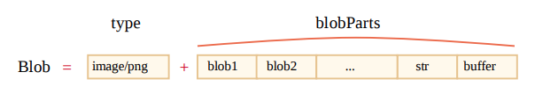

# Blob

ArrayBuffer 和视图都是 ECMA 标准的一部分，是 JavaScript 的一部分。

在浏览器中，还有其他更高级的对象，特别是 Blob，在 File API 中有相关描述。

Blob 由一个可选的字符串 type（通常是 MIME 类型）和 blobParts 组成 —— 一系列其他 Blob 对象，字符串和 BufferSource。



构造语法为：

```js
new Blob(blobParts, options);
```

- blobParts 是 Blob/BufferSource/String 类型的值的数组。
- options 可选对象：
  - type —— Blob 类型，通常是 MIME 类型，例如 image/png。
  - endings —— 是否转换换行符，使 Blob 对应于当前操作系统的换行符（\r\n 或 \n）。默认为 “transparent”（啥也不做），不过也可以是 “native”（转换）。

例如：

```js
// 从字符串创建 Blob
let blob = new Blob(['<html></html>'], { type: 'text/html' });
// 注意第一个字段必须是一个数组
```

```js
// 从类型化数组和字符串创建 Blob
let hello = new Uint8Array([72, 101, 108, 108, 111]);
let blob = new Blob([hello, ' ', 'world'], { type: 'text/plain' });
```

我们可以用 slice 方法来提取 Blob 片段：

```js
blob.slice([byteStart], [byteEnd], [contentType]);
```

- byteStart —— 起始字节，默认为 0。
- byteEnd —— 最后一个字节（专有，默认为最后）。
- contentType —— 新 blob 的 type ，默认与源 blob 相同。

参数值类似于 array.slice ，也允许是负数。

> ⚠️Blob 对象是不可改变的
>
> 我们无法直接在 Blob 中更改数据，但我们可以通过 slice 获得 Blob 的多 个部分，从这些部分创建新的 Blob 对象，将它们组成新的 Blob ，等。 这种行为类似于 JavaScript 字符串：我们无法更改字符串中的字符，但可以生成 一个新的改动过的字符串。


## Blob 作用 URL

Blob 可以很容易用作 \<a> \ 或其他标签的 URL，来显示它们的内容。

多亏了 type，让我们也可以下载/上传 Blob 对象，而在网络请求中，type 自然的变成了 Content-Type。

让我们从一个简单的例子开始。通过点击链接，你可以下载一个具有动态生成的内容 为 hello world 的 Blob 的文件：

```html
<!-- download 特性（attribute） 强制浏览器下载而不是导航 -->
<a download="hello.txt" href="#" id="link">Download</a>

<script>
  let blob = new Blob(['hello,world!'], { type:'text/plain' });
  link.herf = URL.createObjectURL(blob);
</script>
```

我们也可在 JavaScript 中动态创建一个连接，通过 link.click() 模拟一个点击，然后便自动下载。

```js
let link = document.createElement('a');
link.download = 'hello.txt';
let blob = new Blob(['hello,world'],{type:'text/plain'});
link.href = URL.createObjectURL(blob);
link.click();
URL.revokeObjectURL(link.href);
```

**URL.createObjectURL** 取一个 Blob，并为其创建一个唯一的 URL，形式为 blob：\<origin>/\<uuid>。

也就是 link.href 的值的样子：

```bash
blob:https://ba...
```

浏览器内部为每个通过 URL.createObjectURL 生成的 URL 存储了一个 URL -> Blob 的映射。因此，此类 URL 很短，但可以访问 Blob。

**生成的 URL 仅在当前文档打开的状态下才有效。**它允许引用 \，\<a> 中的 Blob，以及基本上任何其他期望 URL 的对象。

不过它有个副作用。虽然这里又 Blob 的映射，但 Blob 本身只能保存在内存中。浏览器无法释放它。

当文档退出时，该映射会被自动清除，因此 Blob 也相应被释放了。但是，如果应用程序寿命很长，那这个释放就不会很快发生。

因此，如果我们创建一个 URL，那么即使我们不再需要该 Blob 了，它也会被挂在内存中。

URL.revokeObjectURL(url) 从内部映射中移除引用，因此允许 Blob 被删除（如果没有其他引用的话），并释放内存。


## Blob 转换 base64

URL.createObjectURL 的一个替代方法是，将 Blob 转换为 base64 编码的字符串。

这种编码将二进制数据表示为一个由 0 到 64 的 ASCII 码组成的字符串，非常安全并且“可读”。更重要的是 —— 我们可以在 “data-url”中使用此类编码。

data-url 的形式为 data:[\<mediatype>[;base64],data]。我们可以在任何地方使用这种 url，和使用常规 url 一样。

```js
let link = document.createElement('a');
link.download = 'hello.txt';

let blob = new Blob(['Hello,world!'], { type: 'text/plain'});

let reader = new FileReader();
reader.readAsDataURL(blob); // 将 Blob 转换为 base64 并调用 onload

reader.onload = function() {
  link.href = reader.result;
  link.click();
}
```


| 区别 | URL.createObjectURL(blob)            | Blob 转换为 data url                       |
| ---- | ------------------------------------ | ------------------------------------------ |
| 内存 | 如果介意内存，需要撤销（revoke）它们 | 无需撤销任何操作                           |
| 解码 | 直接访问 Blob，无需 “编码/解码”      | 对大的 Blob 进行编码时，性能和内存会有损耗 |


## Image 转 Blob

我们可以创建一个图像（image）的，图像的一部分，或者甚至创建一个页面截图的 Blob。这项方便将其上传值任何地方。

图像操作是通过 \<canvas> 元素来实现的。

1. 使用 canvas.drawImage 在 canvas 上绘制图像（或图像的一部分）。
2. 调用 canvas 方法 .toBlob(callback, format, quality) 创建一个 Blob，并在创建完成之后运行其 callback。

```js
```


## Blob 转换为 ArrayBuffer

Blob 构造器允许从几乎所有东西创建 blob，包括任何 BufferSource。

但是，如果我们需要执行低级别的操作的话，则可以使用 FileReader 从 blob 中获 取最低级别的 ArrayBuffer 

```js
let fileReader = new FileReader();

fileReader.readAsArrayBuffer(blob);

fileReader.onload = function(event) {
  let arrayBuffer = fileReader.result;
}
```


## 总结

ArrayBuffer ， Uint8Array 及其他 BufferSource 是“二进制数据”，而 Blob 则表示“具有类型的二进制数据”。

这样可以方便 Blob 用于在浏览器中非常常见的上传/下载操作。

XMLHttpRequest，fetch 等进行 Web 请求的方法可以自然地使用 Blob ，也可以使 用其他类型的二进制数据。

我们可以轻松地在 Blob 和低级别的二进制数据类型之间进行转换：

- 我们可以使用 new Blob(...) 构造函数从一个类型化数组（typed array）创建 Blob 。
- 我们可以使用 FileReader 从 Blob 中取回 ArrayBuffer ，然后在其上创建 一个视图（view），用于低级别的二进制处理。
