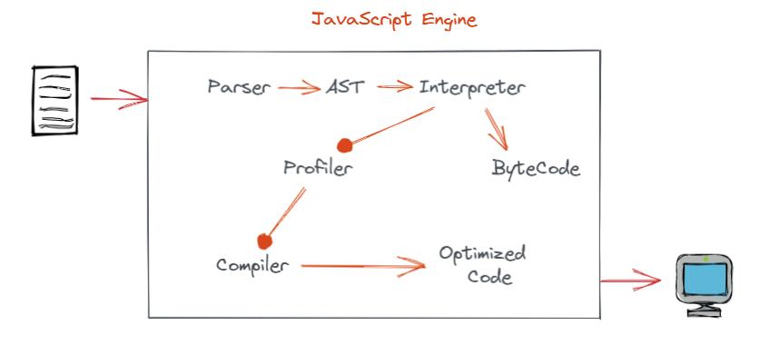
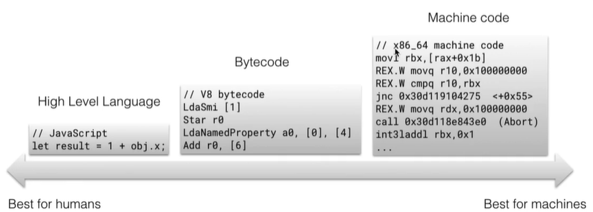
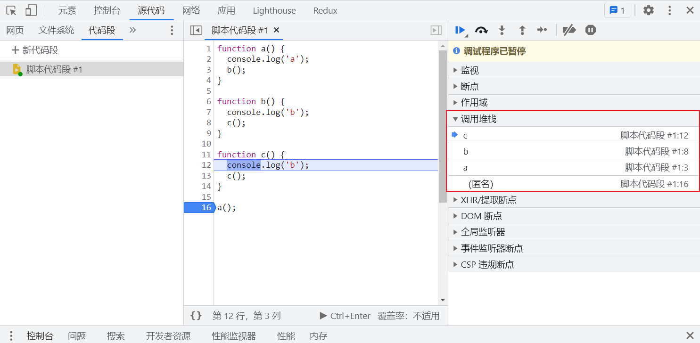
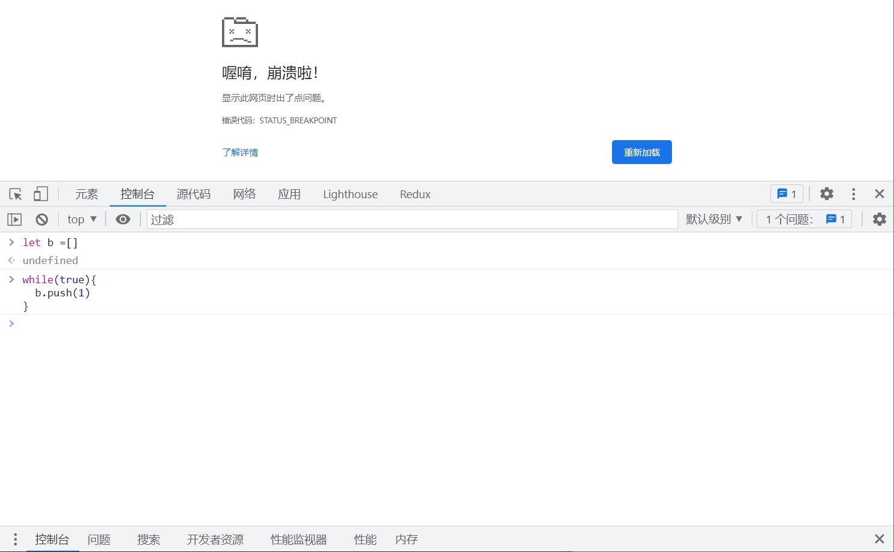

# JS 引擎

js 引擎是一种将我们 js 代码转换为机器可读语言的引擎。如果没有 js 引擎，编写的代码对计算机来说就是一堆 “胡言乱语”。不仅 js，所有语言都需要一个引擎来将这些 “胡言乱语” 转换成对计算机有意义的语言。


## 常见引擎

- v8 -- chrome
- SpiderMonkey -- firefox
- Chakra -- IE/Edge
- ...


## 过程






## 编译语言和解释语言

- 编译语言先将内容编译为二进制，编译消耗一定时间，但执行快（内部会做优化）。
- 解释语言逐行解释，不需要等待编译，立即开始执行，但执行稍慢。

- 地图软件上，使用解释语言会非常吃力。

- JavaScript v8 结合了编译器和解释器，使用了一种即时编译的技术，即 JIT 编译器。 


## Interpreter 和 Compiler

- Interpreter（解释器）：逐行读取代码并执行。
- Compiler（编译器）：读取整个代码，并进行一些优化，生成优化后的代码。

```js
function add(a, b) {
  return a + b;
}
for(let i = 0; i < 1000; i++) {
  add(1 + 1);
}
```

- 对于 Interpreter，接收上面代码后，它将逐行读取并立即执行代码，直到循环结束。它的工作仅仅是实时的将代码转换为计算机可以理解的内容。
- 对于 Compiler，它会先完整的读取整个程序，对我们要执行的代码进行分析，然后进行优化，生成电脑可以读懂的机器语言。过程如同获取 X （我们的 JS 文件）并生成 Y （机器语言）一样。如果我们使用 Interpreter 执行 Y，则会获得与执行 X 相同的结果。

ByteCode 只是中间码，计算机仍需要对其进行翻译才能执行。但是 Interpreter 和 Compiler 都将源代码转换为机器语言，它们唯一的区别在于转换的过程不尽相同。

- Interpreter 逐行将源代码转换为等效的机器代码。
- Compiler 在一开始就将所有源代码转换为机器代码。

> Babel 其实是一个 JS Compiler，它可以接收你编写的新版本 JS 代码并向下编译为与浏览器兼容的 JS 代码（旧版本的 JS 代码）

**优缺点：**

- Interpreter 的优点是无需等待编译即可立即执行。这对在浏览器中运行 JS 提供了极大的便利，因为所有用户都不想浪费时间在等待代码编译这件事上。但是，当有大量的 JS 代码需要执行时运行会比较慢。
- Compiler 需要一定时间进行编译，但最终给出的优化代码能在更短时间内执行完毕。
- 综上所述，Interpreter 可以立即执行代码，带不会进行优化。Compiler 虽然需要花费一些时间来编译代码，但是会生成对执行更优的代码。


## JIT（Just In Time）

考虑到 Interpreter 和 Compiler 的优缺点，产生了同时兼顾的技术，JIT（Just In Time，即时编译）。现在大多数的浏览器都在更快，更高效的实现此功能。


## 过程

- Parser 是一个通过各种 JavaScript 关键词来识别，分析和分类程序各个部分的解析器。它可以区分代码是一个方法还是一个变量。
- 然后，AST（抽象语法树）是基于 Parser 的分类构造树状结构。（https://astexplorer.net/）

- 随后将 AST 提供给 Interpreter 生成 ByteCode。ByteCode 不是最底层的代码，但可以被执行。在此阶段，浏览器借助 v8 引擎执行 ByteCode 进行工作，因此用户无需等待。
- 同时，Profiler 将查找可以被优化的代码，然后将它们传递给 Compiler。Compiler 生成优化代码的同时，浏览器暂时用 ByteCode 执行操作。并且，一旦 Compiler 生成了代码，优化代码将完全替换临时的 ByteCode。
- 通过这种方式，我们可以充分利用 Interpreter 和 Compiler 的优点。Interpreter 执行代码的同时，Profiler 寻找可以被优化的代码，Compiler 则创建优化的代码。然后将 ByteCode 替换为优化后的较为底层的代码，例如机器码。

这意味着性能在逐渐提高，同时不会有阻塞执行的时间。


## JavaScript 是一门解释型语言吗？

是，但不完全是


## 线程

V8 引擎在内部也使用了多个线程：

- 主线程完成你所期望的任务：获取你的代码，然后编译执行。
- 还有一个单独的线程用于编译，以便主线程可以继续执行，而前者就能够优化代码。
- 一个 Profiler (分析器) 线程，它会告诉运行时在哪些方法上我们花了很多的时间，以便 Crankshaft 可以去优化它们。
- 还有一些线程处理垃圾回收扫描。

当第一次执行 JavaScript 代码的时候，V8 利用 full-codegen 直接将解析的 JavaScript 代码不经过任何转换翻译成机器码。这使得它可以 非常快速 的开始执行机器码，请注意，V8 不使用任何中间字节码表示，从而不需要解释器。
  当你的代码已经运行了一段时间了，分析器线程已经收集了足够的数据来告诉运行时哪个方法应该被优化。
  然后， Crankshaft 在另一个线程开始优化。它将 JavaScript 抽象语法树转换成一个叫 Hydrogen 的高级静态单元分配表示(SSA)，并且尝试去优化这个 Hydrogen 图。大多数优化都是在这个级完成。


## Compiler 优化

1. 内容预计算

   ```js
   function add(a, b) {
     return a + b;
   }
   for(let i = 0; i < 1000; i++) {
     add(1 + 1);
   }
   
   // Compiler 优化后
   function add(a, b) {
     return a + b;
   }
   for(let i = 0; i < 1000; i++) {
     2;
   }
   ```

   

## 垃圾回收机制（gc）

对于没有引用指向的内存会被自动回收。

...


## 引擎内部

调用栈（Call Stack）

可以确定代码运行到的位置。



内存堆（Memory Heap）


## 异常

调用栈溢出（Stack Overflow）

```js
function roll() {
  roll();
}

roll(); // Uncaught RangeError: Maximum call stack size exceeded
```


内存泄漏（Memory Leaks）

```js
let arr = [];
while(true) {
  arr.push(1);
}
```



**三种情况：**

- var 变量
- 事件监听未回收（应当及时 removeListener）。
- 死循环添加


## 单线程

JavaScript 是单线程的，同一时间只能做一件事。

synchronous

```js
alert('stop');
```

asynchronous

- setTimeout
- eventListener
- ...


## Run time

浏览器环境

```js
console.log(window);
```

nodejs

```js
console.log(global); 
```


## Event Loop

异步操作会被放在 runtime 中，然后时机到达时回到栈中进行执行。

...


## 代码优化

不使用

- evel
- arguments
- for in
- with
- delete
- hidden classes
- inline caching

