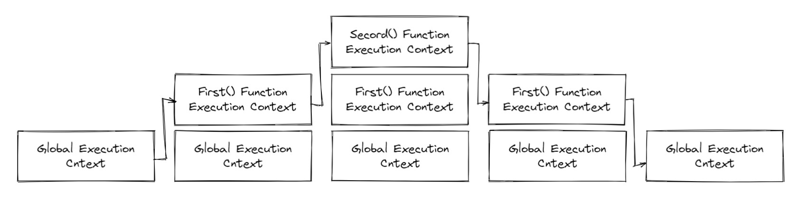

## 执行上下文

#### 介绍

执行上下文是评估和执行 JavaScript 代码的环境的抽象概念。每当 JavaScript 代码运行在运行时，它都是在执行上下文中运行。


#### 类型

##### 全局执行上下文

默认或者说是基础的上下文，任何不在函数内部的代码都在全局上下文中。它会执行两件事：创建一个全局的 window 对象（浏览器的情况下），并且设置 this 的值等于这个全局对象。一个程序中只会有一个全局执行上下文。

##### 函数执行上下文

每当一个函数被调用时，都会为该函数创建一个新的上下文。每个函数都有它自己的执行上下文，不过是在函数被调用时创建的。函数上下文可以有任意个。每当一个新的执行上下文被创建，它会按定义的顺序执行一系列操作。

##### Eval 函数执行上下文

执行在 eval 函数内部的代码也会有它属于自己的执行上下文，但由于 JavaScript 开发者很少使用 eval，所以不讨论。


#### 执行栈

执行栈，也就是在其它编程语言中所说的“调用栈”，是一种拥有LIFO（后进先出）数据结构的栈，被用来存储代码运行时创建的所有执行上下文。

当 JavaScript 引擎第一次遇到你的脚本时，它会创建一个全局的执行上下文并且压入当前执行栈。每当引擎遇到一个函数调用，它会为该函数创建一个新的执行上下文并且压入栈的顶部。

引擎会执行那些执行上下文位于栈顶的函数。当该函数执行结束时，执行上下文从栈中弹出，控制流程到达当前栈中的下一个上下文。


例子：

```js
let a = 'Hello World';

function first(){
  console.log('Inside first function');
  secord();
  console.log('Again inside first function');
}

function second(){
  console.log('Inside second function');
}

first();
console.log('Inside Global Execution Context');
```




上述代码的执行栈。

当上诉代码在浏览器加载时，JavaScript 引擎创建了一个全局执行上下文并把它压入当前的执行栈。当遇到 firtst() 函数调用时，JavaScript 引擎为该函数创建了一个新的执行上下文并且把它压入当前的执行栈顶部。

当从 first() 函数内部调用 secord() 函数时，JavaScript 引擎为 secord() 函数创建了一个新的执行上下文并且把它压入当前执行栈的顶部。当 secord() 函数执行完毕，它的执行上下文从当前栈弹出，并且控制流程到达下一个执行上下文，即 first() 函数的执行上下文。

当 first() 执行完毕，它的执行上下文从栈弹出，控制流程到达全局执行上下文。一旦所有代码执行完毕，JavaScript 引擎从当前栈中移除全局执行上下文。


#### 怎么创建执行上下文？

创建执行上下文有两个阶段 1）创建阶段  2）执行阶段。

##### 创建阶段

在 JavaScript代码执行前，执行上下文将经历创建阶段。创建阶段会发生三件事：

1. this 值的决定，即 **This 绑定**。
2. 创建**词法环境**组件。
3. 创建**变量环境**组件。

所以执行上下文在概念上表示如下：

```js
ExecutionContext = {
  ThisBinding = <this value>,
  LexivalEnvironment = { ... },
  VariableEnvironment = { ... },
}
```

###### This 绑定

在全局执行上下文中，this 的值指向全局对象。（浏览器中window，node中global）。

在函数执行上下文中，this 的值取决于该函数是如何被调用的。如果它被一个引用对象调用，那么 this 会被设置成那个值， 否则 this 的值被设置为全局对象或者 undefined（严格模式）。

```js
let foo = {
  baz: function(){
    console.log(this);
  }
}

foo.baz(); // this 指向 foo

let bar = foo.baz;

bar(); // this 指向 window
```


###### 词法环境

官方ES6定义：

> **词法环境**是一种规范类型，基于 ECMAScript 代码的词法嵌套结构来定义**标识符**和具体变量和函数的关联。一个词法环境由环境记录器和一个可能的引用**外部**词法环境的空值组成。

简单来说：

**词法环境**是一种**标识符—变量映射**的结构。（这里的**标识符**指的是变量/函数的名字，而**变量**是对实际对象[包含函数类型对象]或原始数据的引用）。

现在，在词法环境的内部有两个组件：1）**环境记录器**   2）一个**外部环境的引用**。

1. 环境记录器是存储变量和函数声明的实际位置。
2. 外部环境的引用意味着它可以访问其父级的词法环境（作用域）。

词法环境分类：

- **全局环境**（在全局执行上下文中）是没有外部环境引用的词法环境。全局环境的外部环境的引用为 **null**。它拥有内建的 Object/Array/等、在环境记录器内的原型函数（关联全局对象，比如 window 对象）还有任何用户定义的全局变量，并且 **this** 的值指向全局对象。
- 在**函数环境**中，函数内部用户定义的变量存储在**环境记录器**中。并且引用的外部环境可能是全局环境，或者任何包含此内部函数的外部函数。

环境记录器也有两种类型（如上）：

1. **声明式环境记录器**存储变量、函数和参数（注意：还包含一个 <font color=red>arguments </font>对象（存储索引和参数的映射）和传递给函数的参数 length）。
2. **对象环境记录器**用来定义出现在全局上下文中的变量和函数的关系。

简而言之，

- 在**全局环境**中，环境记录器是**对象环境记录器**。
- 在函数环境中，环境记录器是**声明式环境记录器**。

```js
// 全局词法环境
GlobalExectionContext = {
  LexicalEnvironment: {
    Type: 'Object',
    // 在这里绑定标识符
  },
  outer: <null>,
}

// 函数词法环境
FunctionExectionContext = {
  LexicalEnvironment: {
    Type: 'Declarative',
    // 在这里绑定标识符
  },
  outer: <Global or outer Function environment reference>,
}
```


###### 变量环境

它同样是一个词法环境，其环境记录器持有**变量声明语句**在执行上下文中创建的绑定关系。

如上所诉，变量环境也是一个词法环境，所以它有着上面定义的词法环境的所有属性。

在 ES6 中，**词法环境**和**变量环境**的一个不同就是前者被用来存储函数声明和变量（ let 和 const ）绑定，而后者只用来存储 var 变量绑定。

例子：

```js
let a = 20;
const b = 30;
var c;

function multiply(e, f) {
  var g = 20;
  return e * f *g;  
}

c = multiply(20, 30);
```

执行上下文看起来如下：

```js
GlobalExectionContext = {
  ThisBinding: <Global Object>,
  
  LexicalEnvironment: {
    EnvironmentRecord: {
      Type: 'Object',
      a: <uninitialized>,
      b: <uninitialized>,
      multiply: <func>,
	},
    outer: <null>,
  },
     
  VariableEnvironment: {
    EnvironmentRecord: {
      Type: 'Object',
      c: undefined,
    },
    outer: <null>,
  }
}

// 只有遇到调用函数 multiply 时，该函数执行上下文才会被创建
FunctionExectionContext = {
  ThisBinding: <Global Object>,
  
  LexicalEnvironment: {
    EnvironmentRecord:{
      Type: 'Decalrative',
      Arguments: {0: 20, 1: 30, length: 2},
	},
    outer: <GlobalLexicalEnvironment>,
  },
      
  VariableEnvironment: {
    EnvironmentRecord: {
      Type: 'Decalrative',
      g: undefined,
    },
    outer: <GlobalLexicalEnvironment>,
  }
}
```

可以注意到 let 和 const 定义的变量并没有关联任何值，但 var 定义的变量被设置成了undefined。

这是因为在创建阶段时，引擎检查代码找出变量和函数声明，虽然函数声明完全存储在环境中，但是变量最初设置为 undefined （ var 情况下），或者未初始化（ let 和 const 情况下）。

这就是为什么可以在声明之前访问 var 定义的变量（虽然是 undefined ），但是在声明之前访问 let 和 const 的变量会得到一个引用错误。

这就是我们说的变量提升。


#### 执行阶段

执行阶段是其中最简单的部分。在此阶段，完全对所有这些变量的分配，最后执行代码。

注意：在执行阶段，如果 JavaScript 引擎不能在源码中声明的实际位置找到 let 变量的值，它会被赋值为 undefined。


#### 结论

变量提升，作用域，闭包。