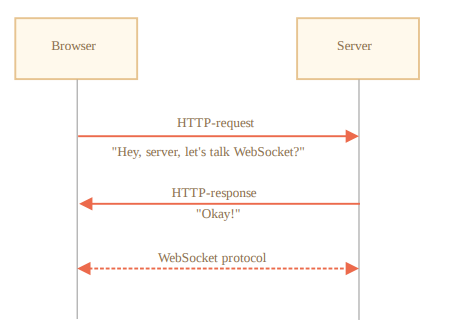

# WebSocket

WebSocket 协议提供了一种在浏览器和服务器之间建立持久连接来交换数据的方法。数据可以作为 “数据包” 在两个方向上传递，而不会断开连接和其他 HTTP 请求。

对于需要连续数据交换的服务，例如网络游戏，实时交易系统等，WebSocket 尤其有用。


## 🌰简单例子

要打开一个 WebSocket 连接，我们需要在 url 中使用特殊的协议 ws 创建 new WebSocket ：

```js
let socket = new WebSocket("ws://javascript.info");
```

同样也有一个加密的 wss:// 协议。类似于 WebSocket 中的 HTTPS。

>😎始终使用 wss://
>
>wss:// 协议不仅是被加密，而且更加可靠。
>
>因为 ws:// 数据不是加密的，对于任何中间人来说其数据都是可见的。并且， 旧的代理服务器不了解 WebSocket，它们可能会因为看到“奇怪的” header 而中止 连接。
>
>另一方面， wss:// 是基于 TLS 的 WebSocket，类似于 HTTPS 是基于 TLS 的 HTTP），传输安全层在发送方对数据进行了加密，在接收方进行解密。因此，数据包是通过代理加密传输的。它们看不到传输的里面的内容，且会让这些数据通过。

一旦 socket 被建立，我们应该监听 socket 上的事件。一共有 4 个事件：

- open —— 连接已建立。
- message —— 接收到数据。
- error —— WebSocket 错误。
- close —— 连接已关闭。

如果我们像发送一些内容，可以使用 socket.send(data)。

示例：

```html
<script>
	let socket = new WebSocket("wss://...");

	socket.onopen = function (e) {
		console.log("[open] Connection established");
		console.log("Sending to server");
		socket.send("My name is John");
	};

	socket.onmessage = function (event) {
		console.log(`[message] Data received form server: ${event.data}`);
	};

	socket.onclose = function (event) {
		if (event.wasClean) {
			console.log(
				`[close] Connection closed cleanly, code=${event.code} reason=${event.reason}`
			);
		} else {
			// 例如服务器进程被杀死或者网络中断
			// 这种情况下，event.code 通常为 1006
			console.log("[close] Connection died");
		}
	};

	socket.onerror = function (error) {
		console.log(`[error] ${error.message}`);
	};
</script>
```


## 建立 WebSocket

当 new WebSocket(url) 被创建后，它将立即开始连接。

在连接期间，浏览器（使用 header）问服务器：“你支持 WebSocket 吗？” 如果服务器说 “我支持”，那么通信就以 WebSocket 协议继续进行，该协议根本不是 HTTP 协议。



这是由 new WebSocket("wss://javascript.info/chat") 发出的请求的浏览器 header 示例。

```bash
GET /chat
Host: javascript.info
Origin: https://javascript.info
Connection: Upgrade
Upgrade: websocket
Sec-WebSocket-Key: Iv8io/9s+lYFgZWcXczP8Q==
Sec-WebSocket-Version: 13
```

- Origin —— 客户端页面的源，例如 https://javascript.info 。 WebSocket 对象是原生支持跨源的。没有特殊的 header 或其他限制。旧的服务器 无法处理 WebSocket，因此不存在兼容性问题。但是 Origin header 很重要， 因为它允许服务器决定是否使用 WebSocket 与该网站通信。
- Connection: Upgrade —— 表示客户端想要更改协议。
- Upgrade: websocket —— 请求的协议是 “websocket”。
- Sec-WebSocket-Key —— 浏览器随机生成的安全密钥。
- Sec-WebSocket-Version —— WebSocket 协议版本，当前为 13。