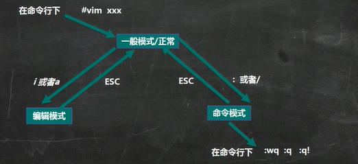

# Vim

Linux 系统会内置 vi 文本编辑器。

Vim 具有程序编程的能力，可以看作 Vi 的增强版，可以主动的以字体颜色辨别语法的正确性，方便程序设计。代码补全，编译以及错误跳转等方便编程的功能特别丰富。


## 模式

### 正常模式

以 vim 打开一个档案就直接进入正常模式。在这个模式中，可以用 【上下左右】来移动光标，以及使用【删除字符】或【删除整行】来处理档案内容，也可以使用【复制粘贴】来处理文件。

### 插入模式

按下 i，I，o，O，a，A，r，R 等任何一个字母之后才会进入编辑模式。

### 命令行模式

在这个模式中，可以提供你相关的指令，完成读取，存盘，替换，离开 vim，显示行等动作。

:wq（保存退出）

:q（退出）

:q!（强制退出，不保存）




## 正常模式

### 拷贝

```bash
yy # 拷贝当前行

5yy # 拷贝当前行至下 5 行

p # 粘贴

dd # 删除当前行

5dd # 删除当前行至下 5 行
```

### 跳转

```bash
gg # 跳到首行
G # 跳到末尾
```

### 撤销

```bash
u # 撤销
```

### 光标跳转

```bash
20 shift g # 光标定位到 20 行
```


## 命令行模式

### 查找

```bash
/hello # 查找 hello，按 n 切换下一个
```

### 行号

```bash
:set nu # 显示行号

:set nonu # 隐藏行号
```


## 更多快捷键

...