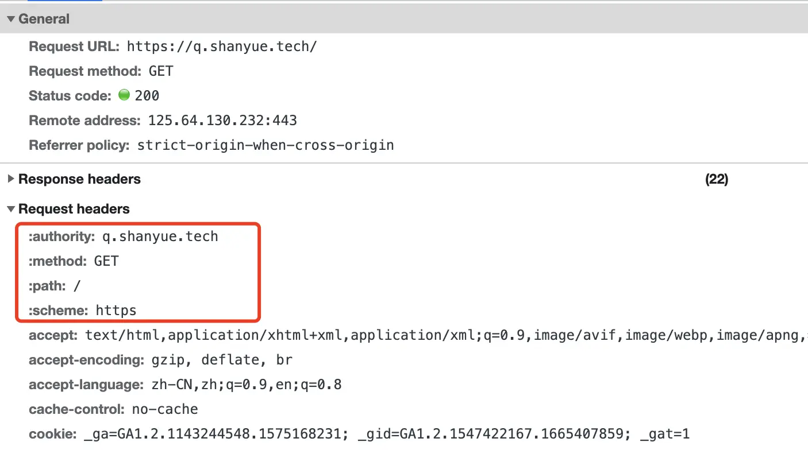

# Header

## 细节点

- HTTP Header 名称不区分大小写。因此 Content-Type 与 content-type 并无差别。
- HTTP Header 名称和值由 **:** 分割，值前面的空格将被忽略。更严格的说，是被 /:\s+/ 分割。因此 A: 3 和 A:    3 并无差别。
- HTTP Header 中的非标准自定义首部由 **X-** 作为前缀，虽已被废弃，但仍然在大量使用。比如 X-Powered-By，仍被大量服务器框架所使用。

## pseudo-header（伪头）

在 HTTP/2 协议中，以 **:** 开头，被称为伪头。他们用于传递 HTTP 报文初始行数据。伪头不属于 HTTP 头部字段。

- :authority，同 Host。
- :method，同 Method。
- :path，同 Path。
- :scheme，同 Scheme，即 HTTPS/HTTP。
- :status，同 Status Code。

