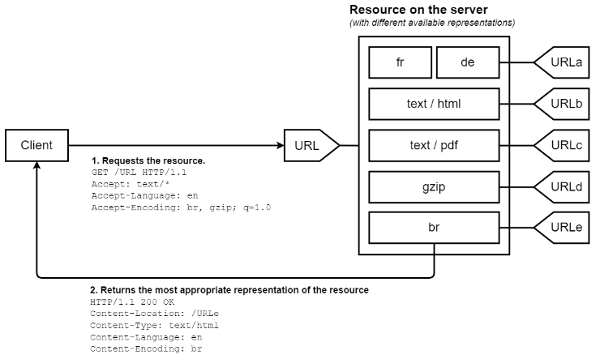

# Header

## 细节点

- HTTP Header 名称不区分大小写。因此 Content-Type 与 content-type 并无差别。
- HTTP Header 名称和值由 **:** 分割，值前面的空格将被忽略。更严格的说，是被 /:\s+/ 分割。因此 A: 3 和 A:    3 并无差别。
- HTTP Header 中的非标准自定义首部由 **X-** 作为前缀，虽已被废弃，但仍然在大量使用。比如 X-Powered-By，仍被大量服务器框架所使用。

## pseudo-header（伪头）

在 HTTP/2 协议中，以 **:** 开头，被称为伪头。他们用于传递 HTTP 报文初始行数据。伪头不属于 HTTP 头部字段。

- :authority，同 Host。
- :method，同 Method。
- :path，同 Path。
- :scheme，同 Scheme，即 HTTPS/HTTP。
- :status，同 Status Code。

## Request Header

### 控制相关：

- Host：一般一个 IP 地址对应 N 个应用，通过 Host 即可定位到对应的应用。
- CaChe-Control：发送请求时，如何控制客户端的缓存策略。
- Expect：与 100 状态码相关。
- Range：指定范围请求，与 206 状态码相关。

### 条件相关：

- If-Match
- If-Modified-Since
- If-Range
- If-None-Match

### 内容协商：

内容协商，告知服务器我需要什么样的资源，比如语言以及压缩编码，如果服务器无法返回相应的资源，则返回 406 状态码。

- Accept：客户端需要什么样的资源，比如 json，html。
- Accept-Encoding：客户端接收怎样的压缩编码，比如 gzip，br。
- Accept-Language：客户端需要什么样的语言，比如 en-US，zh-CN。

### 认证相关：

- Authorization：每次发送请求时，使用该头部携带 token 信息，维护客户端的认真状态。

### 来源相关：

通过这些字段，可以更好的统计用户信息，也可以以此为依据来防止爬虫。

- Referer：当前页面的上一个页面是哪里，或者说该页面是由哪个界面跳转而来。
- User-Agent：用户代理是什么，或者说该界面是由哪个客户端（比如浏览器版本号之类）跳转而来。

## Response Header

### 控制相关：

- Date：HTTP 报文在源服务器产生的时间。
- Age：HTTP 报文在缓存服务器，比如 CDN 中的存储时间，以秒为单位。一般来说，当前时间减去 Date，大约就是 Age 的秒数。
- Cache-Control：HTTP 缓存策略。
- Location：新建资源与重定向资源的路径，与 201/30x 状态码相关。
- Vary：一般作为缓存的键（key），与内容协商相关。

### 条件相关：

- ETag：Entity Tag，用以标志实体的唯一性，与缓存策略 304 状态码相关。
- Last-Modified：资源上次修改时间，与缓存策略 304 状态码相关。

## 内容协商

