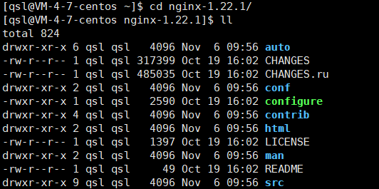

# 安装

## windows

官网下载，下载后打开 exe（一闪而过，可以使用 cmd 运行 nginx.exe），启动 nginx 服务。


所有访问本机 80 端口的服务都会被 nginx 代理。


配置文件在 conf/nginx.conf 中。


## linux

### 手动安装

1. [官网](http://nginx.org/en/download.html)下载 nginx-1.22.1.tar.gz 文件包。 

2. 上传到服务器工作目录。

3. 解压文件。

   ```bash
   tar -zxvf nginx-1.22.1.tar.gz
   ```

   加压后进入 nginx 目录可以看到和 windows 下相同的目录结构。

   

4. 自动配置。

   ```bash
   ./configure
   ```

5. make

   ```bash
   make
   ```

6. make install

   ```bash
   make install
   ```


### 打开 nginx

```bash
whereis nginx # 找到 nginx 安装目录
# nginx: /usr/local/nginx
cd /usr/local/nginx # 进入 nginx 目录
cd sbin # 进入 sbin 目录
./nginx # 执行 nginx 服务
```

此时所有访问本机 80 端口的服务都会被 nginx 代理。


## debian

```bash
# 更新包索引
sudo apt update

# 安装 nginx 软件包
sudo apt install nginx

# 测试安装
curl -I 127.0.0.1

# 停止 nginx 服务
sudo systemctl stop nginx

# 启动 nginx 服务
sudo systemctl start nginx

# 重启 nginx 服务
sudo systemctl restart nginx

# 配置更改后重新加载 nginx 服务
sudo systemctl reload nginx

# 禁用 nginx 服务在系统启动时启动
sudo systemctl disable nginx

# 启用 nginx 服务在系统启动时启动
sudo systemctl enable nginx
```

