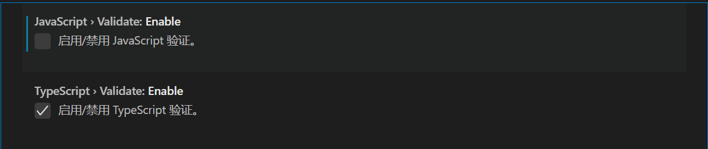

## 全局安装

```bash
npm i -g typescript
# yarn add -g typescript
```

使用 tsc 命令

```bash
tsc index.ts
```


内部安装

```js
npm i typescript
```

内部运行

```bash
yarn tsc index.ts

npx tsc index.ts
```


监听（实时转换 ts）

```bash
tsc index.ts -w
```

```bash
# 全局监听
tsc -w
```


初始化 tsconfig.json

```js
tsc --init
```


## webpack 集成

tsconfig.json


