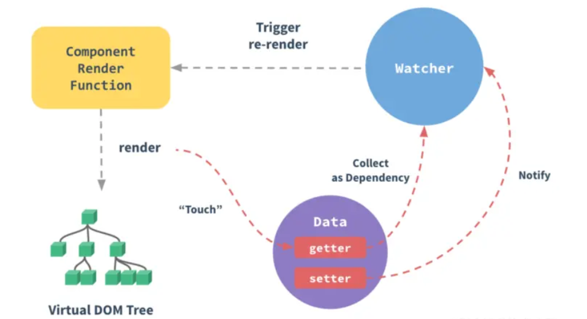
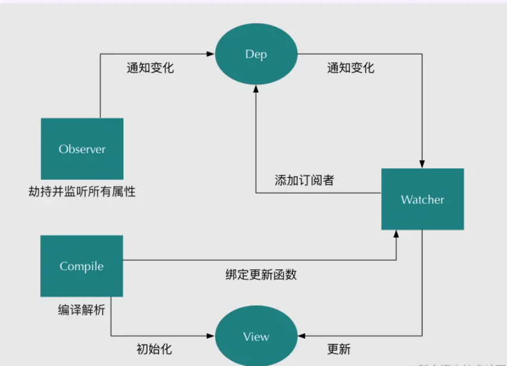
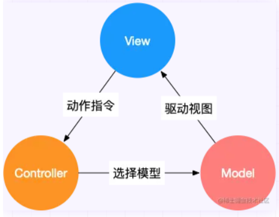
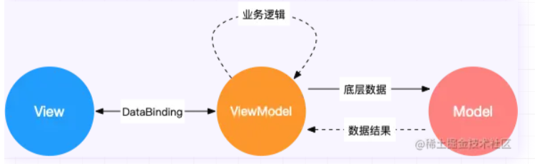
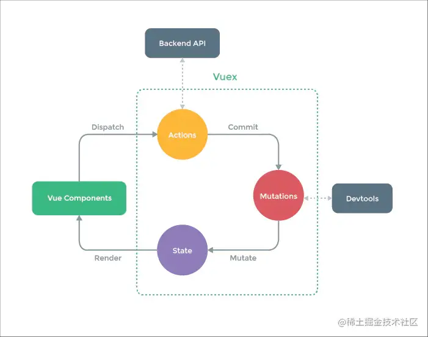

# Vue 面试题

## Vue 基本原理

当一个 Vue 实例创建时，Vue 会遍历 data 中的属性，用 Object.defineProperty（vue3.0使用proxy ）将它们转为 getter/setter，并且在内部追踪相关依赖，在属性被访问和修改时通知变化。 每个组件实例都有相应的 watcher 程序实例，它会在组件渲染的过程中把属性记录为依赖，之后当依赖项的 setter 被调用时，会通知 watcher 重新计算，从而致使它关联的组件得以更新。




## 双向数据绑定的原理

Vue.js 是采用**数据劫持**结合**发布者-订阅者模式**的方式，通过 Object.defineProperty() 来劫持各个属性的 setter，getter，在数据变动时发布消息给订阅者，触发相应的监听回调。主要分为以下几个步骤：

1. 需要 observe 的数据对象进行递归遍历，包括子属性对象的属性，都加上 setter 和 getter 这样的话，给这个对象的某个值赋值，就会触发 setter，那么就能监听到了数据变化。
2. compile 解析模板指令，将模板中的变量替换成数据，然后初始化渲染页面视图，并将每个指令对应的节点绑定更新函数，添加监听数据的订阅者，一旦数据有变动，收到通知，更新视图。
3. Watcher 订阅者是 Observer 和 Compile 之间通信的桥梁，主要做的事情是: ① 在自身实例化时往属性订阅器(dep)里面添加自己。 ② 自身必须有一个update()方法。 ③待属性变动dep.notice() 通知时，能调用自身的 update() 方法，并触发 Compile 中绑定的回调，则功成身退。
4. MVVM 作为数据绑定的入口，整合 Observer、Compile 和 Watcher 三者，通过 Observer 来监听自己的 model 数据变化，通过 Compile 来解析编译模板指令，最终利用 Watcher 搭起Observer 和 Compile 之间的通信桥梁，达到数据变化 -> 视图更新；视图交互变化(input) -> 数据 model 变更的双向绑定效果。




## 使用 Object.defineProperty() 来进行数据劫持有什么缺点？

在对一些属性进行操作时，使用这种方法无法拦截，比如通过下标方式修改数组数据或者给对象新增属性，这都不能触发组件的重新渲染，因为 Object.defineProperty 不能拦截到这些操作。更精确的来说，对于数组而言，大部分操作都是拦截不到的，只是 Vue 内部通过重写函数的方式解决了这个问题。

在 Vue3.0 中已经不使用这种方式了，而是通过使用 Proxy 对对象进行代理，从而实现数据劫持。使用 Proxy 的好处是它可以完美的监听到任何方式的数据改变，唯一的缺点是兼容性的问题，因为 Proxy 是 ES6 的语法。


## MVC 和 MVVM 的区别

MVC 和 MVVM 是三种常见的软件架构设计模式，主要通过分离关注点的方式来组织代码结构，优化开发效率。

在开发单页面应用时，往往一个路由页面对应了一个脚本文件，所有的页面逻辑都在一个脚本文件里。页面的渲染、数据的获取，对用户事件的响应所有的应用逻辑都混合在一起，这样在开发简单项目时，可能看不出什么问题，如果项目变得复杂，那么整个文件就会变得冗长、混乱，这样对项目开发和后期的项目维护是非常不利的。

**MVC**

MVC 通过分离 Model、View 和 Controller 的方式来组织代码结构。其中 View 负责页面的显示逻辑，Model 负责存储页面的业务数据，以及对相应数据的操作。并且 View 和 Model 应用了观察者模式，当 Model 层发生改变的时候它会通知有关 View 层更新页面。Controller 层是 View 层和 Model 层的纽带，它主要负责用户与应用的响应操作，当用户与页面产生交互的时候，Controller 中的事件触发器就开始工作了，通过调用 Model 层，来完成对 Model 的修改，然后 Model 层再去通知 View 层更新。



**MVVM**

MVVM 分为 Model、View、ViewModel：

- Model 代表数据模型，数据和业务逻辑都在 Model 层中定义；
- View 代表 UI 视图，负责数据的展示；
- ViewModel 负责监听 Model 中数据的改变并且控制视图的更新，处理用户交互操作；

Model 和 View 并无直接关联，而是通过ViewModel来进行联系的，Model 和 ViewModel 之间有着双向数据绑定的联系。因此当 Model 中的数据改变时会触发 View 层的刷新，View 中由于用户交互操作而改变的数据也会在 Model 中同步。

这种模式实现了 Model 和 View 的数据自动同步，因此开发者只需要专注于数据的维护操作即可，而不需要自己操作 DOM。




## Computed 和 Watch 的区别

**对于Computed：**

- 它支持缓存，只有依赖的数据发生了变化，才会重新计算。
- 不支持异步，当 Computed 中有异步操作时，无法监听数据的变化。
- computed 的值会默认走缓存，计算属性是基于它们的响应式依赖进行缓存的，也就是基于 data 声明过，或者父组件传递过来的 props 中的数据进行计算的。
- 如果一个属性是由其他属性计算而来的，这个属性依赖其他的属性，一般会使用computed。
- 如果 computed 属性的属性值是函数，那么默认使用 get 方法，函数的返回值就是属性的属性值；在computed中，属性有一个 get 方法和一个 set 方法，当数据发生变化时，会调用 set 方法。

**对于Watch：**

- 它不支持缓存，数据变化时，它就会触发相应的操作。
- 支持异步监听。
- 监听的函数接收两个参数，第一个参数是最新的值，第二个是变化之前的值。
- 当一个属性发生变化时，就需要执行相应的操作。
- 监听数据必须是 data 中声明的或者父组件传递过来的props中的数据，当发生变化时，会触发其他操作，函数有两个的参数：
  - immediate：组件加载立即触发回调函数
  - deep：深度监听，发现数据内部的变化，在复杂数据类型中使用，例如数组中的对象发生变化。需要注意的是，deep 无法监听到数组和对象内部的变化。
- 当想要执行异步或者昂贵的操作以响应不断的变化时，就需要使用 watch。

**总结：**

- computed 计算属性 : 依赖其它属性值，并且 computed 的值有缓存，只有它依赖的属性值发生改变，下一次获取 computed 的值时才会重新计算 computed 的值。
- watch 侦听器 : 更多的是**观察**的作用，**无缓存性**，类似于某些数据的监听回调，每当监听的数据变化时都会执行回调进行后续操作。

**运用场景：**

- 当需要进行数值计算,并且依赖于其它数据时，应该使用 computed，因为可以利用 computed 的缓存特性，避免每次获取值时都要重新计算。
- 当需要在数据变化时执行异步或开销较大的操作时，应该使用 watch，使用 watch 选项允许执行异步操作 ( 访问一个 API )，限制执行该操作的频率，并在得到最终结果前，设置中间状态。这些都是计算属性无法做到的。


## Computed 和 Methods 的区别

可以将同一函数定义为一个 method 或者一个计算属性。对于最终的结果，两种方式是相同的。

**不同点：**

- computed: 计算属性是基于它们的依赖进行缓存的，只有在它的相关依赖发生改变时才会重新求值；
- method 调用总会执行该函数。


## slot是什么？有什么作用？原理是什么？

slot 又名插槽，是 Vue 的内容分发机制，组件内部的模板引擎使用 slot 元素作为承载分发内容的出口。插槽 slot 是子组件的一个模板标签元素，而这一个标签元素是否显示，以及怎么显示是由父组件决定的。slot 又分三类，默认插槽，具名插槽和作用域插槽。

默认插槽：又名匿名插槽，当 slot 没有指定 name 属性值的时候一个默认显示插槽，一个组件内只有有一个匿名插槽。

具名插槽：带有具体名字的插槽，也就是带有 name 属性的 slot，一个组件可以出现多个具名插槽。

作用域插槽：默认插槽、具名插槽的一个变体，可以是匿名插槽，也可以是具名插槽，该插槽的不同点是在子组件渲染作用域插槽时，可以将子组件内部的数据传递给父组件，让父组件根据子组件的传递过来的数据决定如何渲染该插槽。


## 过滤器的作用，如何实现一个过滤器

根据过滤器的名称，过滤器是用来过滤数据的，在Vue中使用`filters`来过滤数据，`filters`不会修改数据，而是过滤数据，改变用户看到的输出（计算属性 `computed` ，方法 `methods` 都是通过修改数据来处理数据格式的输出显示）。

**使用场景：**

- 需要格式化数据的情况，比如需要处理时间、价格等数据格式的输出 / 显示。
- 比如后端返回一个 **年月日的日期字符串**，前端需要展示为 **多少天前** 的数据格式，此时就可以用`fliters`过滤器来处理数据。

过滤器是一个函数，它会把表达式中的值始终当作函数的第一个参数。过滤器用在**插值表达式 \**`{{ }}` 和 `v-bind`\** 表达式** 中，然后放在操作符“ `|` ”后面进行指示。

```js
<li>商品价格：{{item.price | filterPrice}}</li>

 filters: {
    filterPrice (price) {
      return price ? ('￥' + price) : '--'
    }
  }

```


## 常见的事件修饰符及其作用

- `.stop`：等同于 JavaScript 中的 `event.stopPropagation()` ，防止事件冒泡；
- `.prevent` ：等同于 JavaScript 中的 `event.preventDefault()` ，防止执行预设的行为（如果事件可取消，则取消该事件，而不停止事件的进一步传播）；
- `.capture` ：与事件冒泡的方向相反，事件捕获由外到内；
- `.self` ：只会触发自己范围内的事件，不包含子元素；
- `.once` ：只会触发一次。


##  v-if 和 v-show 的区别

- **手段**：v-if 是动态的向 DOM 树内添加或者删除 DOM 元素；v-show 是通过设置 DOM 元素的 display 样式属性控制显隐；
- **编译过程**：v-if 切换有一个局部编译/卸载的过程，切换过程中合适地销毁和重建内部的事件监听和子组件；v-show 只是简单的基于 css 切换；
- **编译条件**：v-if 是惰性的，如果初始条件为假，则什么也不做；只有在条件第一次变为真时才开始局部编译; v-show 是在任何条件下，无论首次条件是否为真，都被编译，然后被缓存，而且 DOM 元素保留；
- **性能消耗**：v-if 有更高的切换消耗；v-show 有更高的初始渲染消耗；
- **使用场景**：v-if 适合运营条件不大可能改变；v-show 适合频繁切换。


## v-model 是如何实现的，语法糖实际是什么？

1. **作用在表单元素上** 动态绑定了 input 的 value 指向了 messgae 变量，并且在触发 input 事件的时候去动态把 message设置为目标值：

   ```vue
   <input v-model="sth" />
   //  等同于
   <input 
       v-bind:value="message" 
       v-on:input="message=$event.target.value"
   >
   ```

2. **作用在组件上** 在自定义组件中，v-model 默认会利用名为 value 的 prop和名为 input 的事件


## data 为什么是一个函数而不是对象

JavaScript 中的对象是引用类型的数据，当多个实例引用同一个对象时，只要一个实例对这个对象进行操作，其他实例中的数据也会发生变化。

而在 Vue 中，更多的是想要复用组件，那就需要每个组件都有自己的数据，这样组件之间才不会相互干扰。

所以组件的数据不能写成对象的形式，而是要写成函数的形式。数据以函数返回值的形式定义，这样当每次复用组件的时候，就会返回一个新的 data，也就是说每个组件都有自己的私有数据空间，它们各自维护自己的数据，不会干扰其他组件的正常运行。


## 对 keep-alive 的理解，它是如何实现的，具体缓存的是什么？

如果需要在组件切换的时候，保存一些组件的状态防止多次渲染，就可以使用 keep-alive 组件包裹需要保存的组件。

keep-alive有以下三个属性：

- include 字符串或正则表达式，只有名称匹配的组件会被匹配；
- exclude 字符串或正则表达式，任何名称匹配的组件都不会被缓存；
- max 数字，最多可以缓存多少组件实例。

注意：keep-alive 包裹动态组件时，会缓存不活动的组件实例。

**主要流程**

1. 判断组件 name ，不在 include 或者在 exclude 中，直接返回 vnode，说明该组件不被缓存。
2. 获取组件实例 key ，如果有获取实例的 key，否则重新生成。
3. key生成规则，cid +"∶∶"+ tag ，仅靠cid是不够的，因为相同的构造函数可以注册为不同的本地组件。
4. 如果缓存对象内存在，则直接从缓存对象中获取组件实例给 vnode ，不存在则添加到缓存对象中。
5. 最大缓存数量，当缓存组件数量超过 max 值时，清除 keys 数组内第一个组件。


## $nextTick 原理及作用

Vue 的 nextTick 其本质是对 JavaScript 执行原理 EventLoop 的一种应用。

nextTick 的核心是利用了如 Promise 、MutationObserver、setImmediate、setTimeout的原生 JavaScript 方法来模拟对应的微/宏任务的实现，本质是为了利用 JavaScript 的这些异步回调任务队列来实现 Vue 框架中自己的异步回调队列。


## Vue template 到 render 的过程

vue的模版编译过程主要如下：**template -> ast -> render函数**


## 描述下Vue自定义指令


##  子组件可以直接改变父组件的数据吗？

子组件不可以直接改变父组件的数据。这样做主要是为了维护父子组件的单向数据流。每次父级组件发生更新时，子组件中所有的 prop 都将会刷新为最新的值。如果这样做了，Vue 会在浏览器的控制台中发出警告。

Vue 提倡单向数据流，即父级 props 的更新会流向子组件，但是反过来则不行。这是为了防止意外的改变父组件状态，使得应用的数据流变得难以理解，导致数据流混乱。如果破坏了单向数据流，当应用复杂时，debug 的成本会非常高。

**只能通过 \**`$emit`\** 派发一个自定义事件，父组件接收到后，由父组件修改。**


## 对 React 和 Vue 的理解，它们的异同

**相似之处：**

- 都将注意力集中保持在核心库，而将其他功能如路由和全局状态管理交给相关的库；
- 都有自己的构建工具，能让你得到一个根据最佳实践设置的项目模板；
- 都使用了Virtual DOM（虚拟DOM）提高重绘性能；
- 都有 props 的概念，允许组件间的数据传递；
- 都鼓励组件化应用，将应用分拆成一个个功能明确的模块，提高复用性。

**不同之处 ：**

**1）数据流**

Vue默认支持数据双向绑定，而React一直提倡单向数据流

**2）虚拟DOM**

Vue2.x开始引入"Virtual DOM"，消除了和React在这方面的差异，但是在具体的细节还是有各自的特点。

- Vue宣称可以更快地计算出Virtual DOM的差异，这是由于它在渲染过程中，会跟踪每一个组件的依赖关系，不需要重新渲染整个组件树。
- 对于React而言，每当应用的状态被改变时，全部子组件都会重新渲染。当然，这可以通过 PureComponent/shouldComponentUpdate这个生命周期方法来进行控制，但Vue将此视为默认的优化。

**3）组件化**

React与Vue最大的不同是模板的编写。

- Vue鼓励写近似常规HTML的模板。写起来很接近标准 HTML元素，只是多了一些属性。
- React推荐你所有的模板通用JavaScript的语法扩展——JSX书写。

具体来讲：React中render函数是支持闭包特性的，所以import的组件在render中可以直接调用。但是在Vue中，由于模板中使用的数据都必须挂在 this 上进行一次中转，所以 import 一个组件完了之后，还需要在 components 中再声明下。

**4）监听数据变化的实现原理不同**

- Vue 通过 getter/setter 以及一些函数的劫持，能精确知道数据变化，不需要特别的优化就能达到很好的性能
- React 默认是通过比较引用的方式进行的，如果不优化（PureComponent/shouldComponentUpdate）可能导致大量不必要的vDOM的重新渲染。这是因为 Vue 使用的是可变数据，而React更强调数据的不可变。

**5）高阶组件**

react可以通过高阶组件（HOC）来扩展，而Vue需要通过mixins来扩展。

高阶组件就是高阶函数，而React的组件本身就是纯粹的函数，所以高阶函数对React来说易如反掌。相反Vue.js使用HTML模板创建视图组件，这时模板无法有效的编译，因此Vue不能采用HOC来实现。

**6）构建工具**

两者都有自己的构建工具：

- React ==> Create React APP
- Vue ==> vue-cli

**7）跨平台**

- React ==> React Native
- Vue ==> Weex


## assets 和 static 的区别


## 什么是 mixin ？

- Mixin 使我们能够为 Vue 组件编写可插拔和可重用的功能。
- 如果希望在多个组件之间重用一组组件选项，例如生命周期 hook、 方法等，则可以将其编写为 mixin，并在组件中简单的引用它。
- 然后将 mixin 的内容合并到组件中。如果你要在 mixin 中定义生命周期 hook，那么它在执行时将优化于组件自已的 hook。


## 对SSR的理解

SSR也就是服务端渲染，也就是将Vue在客户端把标签渲染成HTML的工作放在服务端完成，然后再把html直接返回给客户端

**SSR的优势：**

- 更好的SEO
- 首屏加载速度更快

**SSR 的缺点：**

- 开发条件会受到限制，服务器端渲染只支持 beforeCreate 和 created 两个钩子；
- 当需要一些外部扩展库时需要特殊处理，服务端渲染应用程序也需要处于 Node.js 的运行环境；
- 更多的服务端负载。


## 说一下 Vue 的生命周期

**beforeCreate**

**created**

**beforeMount**

**mounted**

**beforeUpdate**

**updated**

**beforeDestroy**

**destroyed**


## created和mounted的区别

- created : 在模板渲染成 html 前调用，即通常初始化某些属性值，然后再渲染成视图。
- mounted : 在模板渲染成 html 后调用，通常是初始化页面完成后，再对 html 的 dom 节点进行一些需要的操作。


## 组件通信

### 1. props  /  $emit

### 2. eventBus事件总线（`$emit / $on`）

### 3. 依赖注入（provide / inject）

### 4. ref / $refs

### 5.$ parent / $children


## Vue-Router 的懒加载如何实现

```js
const List = () => import('@/components/list.vue')
```


## 路由的 hash 和 history 模式的区别

#### hash模式

**简介：** hash模式是开发中默认的模式，它的URL带着一个#，例如：[www.abc.com/#/vue](https://link.juejin.cn?target=http%3A%2F%2Fwww.abc.com%2F%23%2Fvue)，它的hash值就是`#/vue`。

**特点**：hash值会出现在URL里面，但是不会出现在HTTP请求中，对后端完全没有影响。所以改变hash值，不会重新加载页面。这种模式的浏览器支持度很好，低版本的IE浏览器也支持这种模式。hash路由被称为是前端路由，已经成为SPA（单页面应用）的标配。

#### history模式

**简介：** history模式的URL中没有#，它使用的是传统的路由分发模式，即用户在输入一个URL时，服务器会接收这个请求，并解析这个URL，然后做出相应的逻辑处理。 **特点：** 当使用history模式时，URL就像这样：[abc.com/user/id](https://link.juejin.cn?target=http%3A%2F%2Fabc.com%2Fuser%2Fid)。相比hash模式更加好看。但是，history模式需要后台配置支持。如果后台没有正确配置，访问时会返回404。 **API：** history api可以分为两大部分，切换历史状态和修改历史状态：


## Vuex




## Vue 3.0